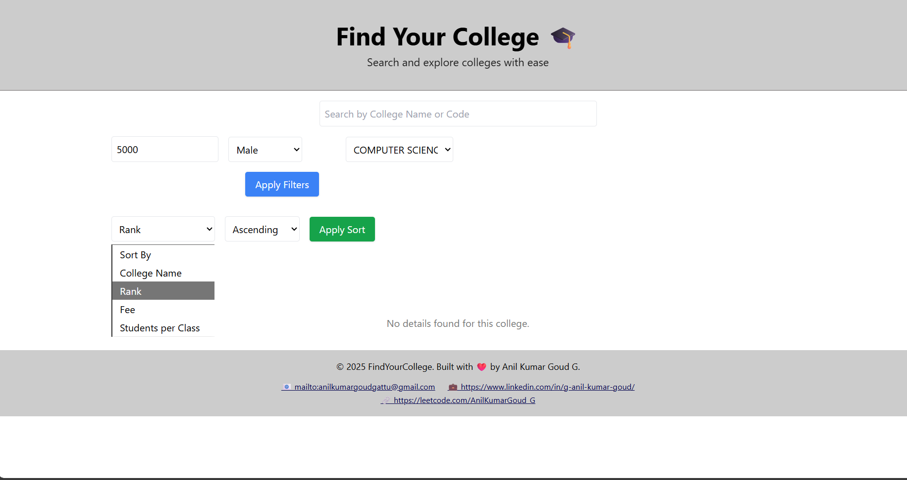
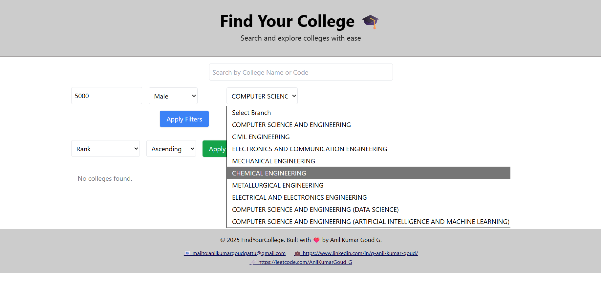
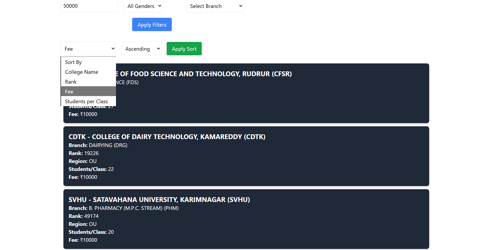
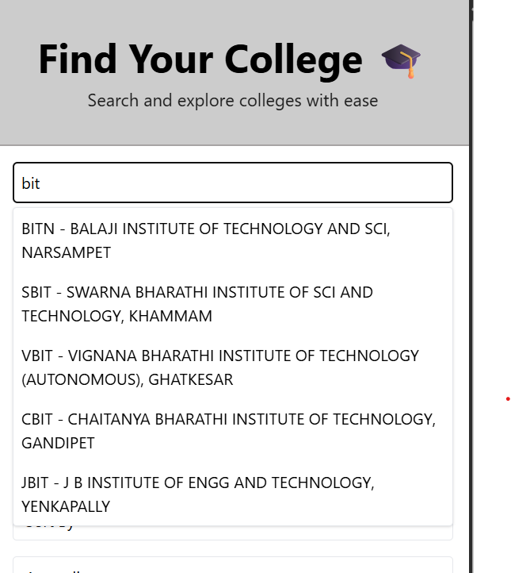
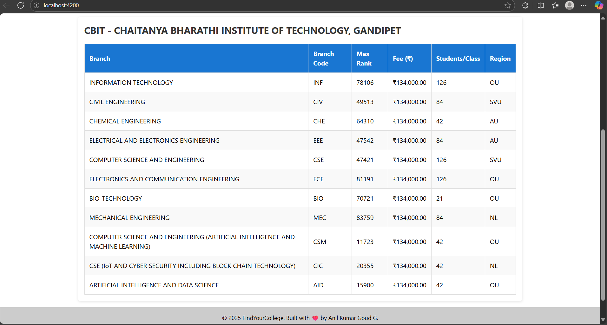

# Find Your College 🎓

A full‑stack web app to **search, filter, and explore engineering colleges** with ease.  
Frontend: **Angular + Tailwind** · Backend: **Spring Boot (Java)** · Packaging: **Maven**

---

## ✨ Core Features

- **Instant search (type‑ahead)** by college code or name.
- **Smart filtering** by **Rank**, **Gender**, and **Branch**.
- **Sorting** by **College Name**, **Rank**, **Fee**, or **Students per Class** (ascending/descending).
- **Rich results** view with concise college cards.
- **Details page** with per‑branch cutoffs, fees, capacity, and region.
- **Accessible footer** with quick contact links.

---

## 🧭 Product Walkthrough

### 1) Landing & Filters
On load you see the search bar and filter controls (Rank, Gender, Branch). If nothing matches, a friendly **empty state** is shown.


### 2) Branch Selector
Pick a specialization from the **Branch** dropdown. Long names are handled gracefully.


### 3) Apply Filters & Sort
Tune results with **Sort By** + **Ascending/Descending**, then click **Apply Sort**. Results render as clean, readable cards.


### 4) Instant Search (Type‑ahead)
Start typing a code or name (e.g., `bit`) to get immediate suggestions. Choose one to jump to the college.


### 5) College Details Page
Open a college to see **branch‑wise** data: *Branch*, *Code*, *Max Rank*, *Fee*, *Students per Class*, and *Region* — perfect for quick comparisons.


### 6) Footer
Persistent footer with **email**, **LinkedIn**, and **LeetCode** links.


---

## 🧱 Architecture Overview

```text
Angular (UI)  ──► REST API calls ──► Spring Boot (Controllers → Services → Repositories) ──► Database
                                ◄── JSON responses ◄───────────────────────────────────────────────
```

- **Frontend** serves the UI, handles form inputs, and renders results.
- **Backend** exposes REST endpoints that accept filters (rank, gender, branch) and sorting options, then returns paginated/filtered JSON.

---

## ⚙️ Tech Stack

- **Frontend:** Angular, Tailwind CSS
- **Backend:** Java 17+, Spring Boot , Spring Web, Spring Data JPA
- **Build:** Maven
- **DB:** MySQL 

---

## 🚀 Run Locally

### Prerequisites
- Java JDK 17+
- Maven 3.9+
- A running SQL database (or adapt to your setup)

### Backend
```bash
cd Backend
# Configure src/main/resources/application.properties first
mvn spring-boot:run
# Server runs at http://localhost:8080
```

Example properties:
```properties
spring.datasource.url=jdbc:mysql://localhost:3306/find_your_college
spring.datasource.username=YOUR_USER
spring.datasource.password=YOUR_PASS
spring.jpa.hibernate.ddl-auto=update
spring.jpa.show-sql=true
```

### Frontend
```bash
cd Frontend
npm install
npm start # or: ng serve
# App runs at http://localhost:4200
```

> Ensure the frontend environment points to your backend, e.g. `environment.ts`:
```ts
export const environment = { apiBaseUrl: 'http://localhost:8080/api' };
```

---

## 🔗 Key Endpoints (example)

| Method | Endpoint                        | Query Params                             | Use case                       |
|-------:|---------------------------------|------------------------------------------|--------------------------------|
| GET    | `/api/colleges`                 | `q, rank, gender, branch, sort, order`   | Search & list colleges         |
| GET    | `/api/colleges/{code}`          | –                                        | College details by code        |
| GET    | `/api/branches`                 | –                                        | Branch metadata for dropdown   |


---


## 🧪 Project Structure

```
Find-Your-College/
├── Frontend/                 # Angular app
│   ├── src/
│   ├── angular.json
│   └── package.json
├── Backend/                  # Spring Boot app
│   ├── src/main/java/...
│   ├── src/main/resources/application.properties
│   └── pom.xml
└── docs/
    └── images/               # Screenshots used in this README
```

---

---

## 🙌 Credits

Built with ❤️ by **Anil Kumar Goud G**  
- Email: anilkumargoudgattu@gmail.com  
- LinkedIn: https://www.linkedin.com/in/g-anil-kumar-goud/  
- LeetCode: https://leetcode.com/AnilKumarGoud_G

---

## 📄 License

MIT
